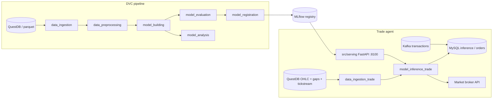
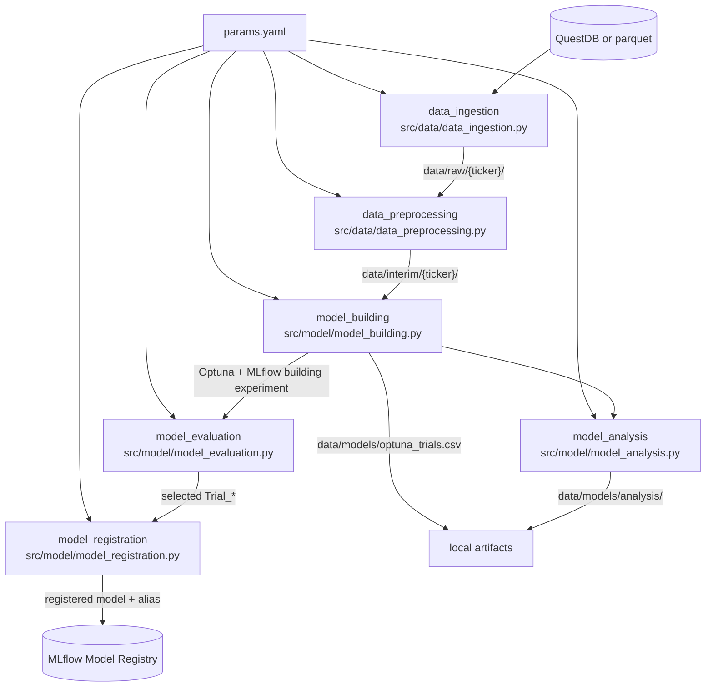
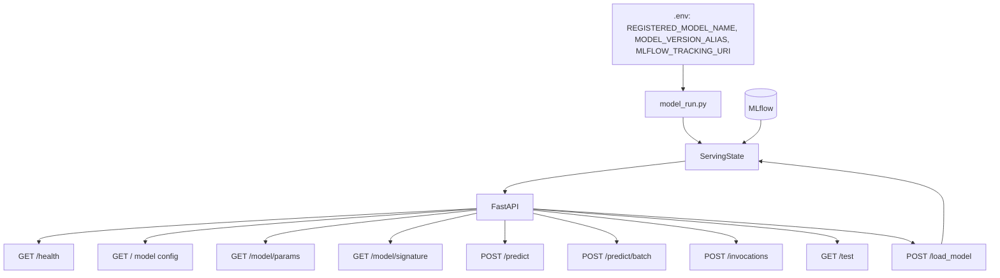
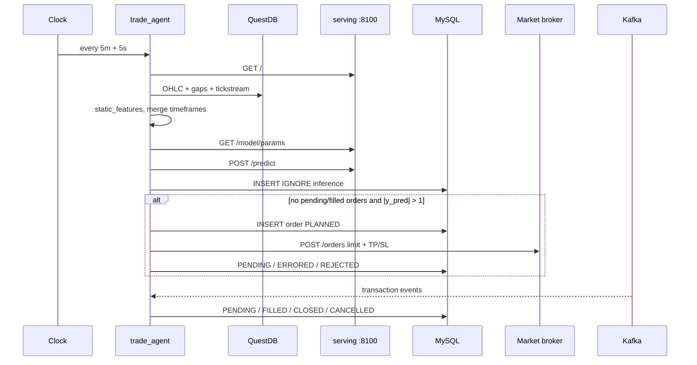

# Introduction

Alpha backtesting engine and data pipeline for multi timeframe, stock market prediction using XGBoost, SVM Regressor, SVM Classifier, LightGBM, extensible to other ML and Deep learning models, including RL.
Can be deployed locally or on AWS (additional configuration required) via Lambda and Step Functions as part of an automated **MLOps** pipeline.

Includes model serving application with API for served model management/load of new models.


## Installation

pip install -r requirements.txt


## DVC

dvc init

dvc repro

dvc dag


### Json data demo in postman

http://localhost:5000/predict

```python
{
(...)
}
```


# AWS-CICD-Deployment-with-Github-Actions

## 1. Login to AWS console.

## 2. Create IAM user for deployment

	#with specific access

	1. EC2 access : It is virtual machine

	2. ECR: Elastic Container registry to save your docker image in aws


	#Description: About the deployment

	1. Build docker image of the source code

	2. Push your docker image to ECR

	3. Launch Your EC2 

	4. Pull Your image from ECR in EC2

	5. Lauch your docker image in EC2

	#Policy:

	1. AmazonEC2ContainerRegistryFullAccess

	2. AmazonEC2FullAccess

	
## 3. Create ECR repo to store/save docker image
    - Save the URI: ...

	
## 4. Create EC2 machine (Ubuntu) 

## 5. Open EC2 and Install docker in EC2 Machine:
	
	
	#optinal

	sudo apt-get update -y

	sudo apt-get upgrade
	
	#required

	curl -fsSL https://get.docker.com -o get-docker.sh

	sudo sh get-docker.sh

	sudo usermod -aG docker ubuntu

	newgrp docker
	
# 6. Configure EC2 as self-hosted runner:
    setting>actions>runner>new self hosted runner> choose os> then run command one by one


# 7. Setup github secrets:

    AWS_ACCESS_KEY_ID=

    AWS_SECRET_ACCESS_KEY=

    AWS_REGION = us-east-1

    AWS_ECR_LOGIN_URI =

    ECR_REPOSITORY_NAME = algo-app


# Application architecture

The system has three layers that share configuration from `params.yaml` and models from MLflow:

1. **DVC training pipeline** — ingest historical OHLC, engineer features, tune and register a model.
2. **Model serving** (`src/serving`) — FastAPI service that loads a registered MLflow model and scores live feature rows.
3. **Trade agent** (`src/trade`) — scheduled process that rebuilds live features, calls serving, and places/cancels broker orders.



Training writes a tagged model into MLflow. Serving loads that alias (for example `Staging`) and exposes HTTP prediction. The trade agent never loads the model itself; it fetches params and scores from serving, then writes predictions and orders to MySQL.


## DVC pipeline

Stages are declared in `dvc.yaml`. Parameters, ticker, timeframes, feature lists, and MLflow experiment settings live in `params.yaml`. Reproduce the pipeline with `dvc repro`; inspect the graph with `dvc dag`.



| Stage | Script | Role | Outputs |
| --- | --- | --- | --- |
| `data_ingestion` | `src/data/data_ingestion.py` | Load multi-timeframe OHLC from QuestDB (`data_source: questdb`) or parquet. Wavelet-denoise the barrier series and resample to the base timeframe. | `data/raw/{ticker}/data_ohlc_{timeframe}.csv` |
| `data_preprocessing` | `src/data/data_preprocessing.py` | Convert timestamps to the local timezone and compute static technical features. | `data/interim/{ticker}/data_static_features_{timeframe}.csv` |
| `model_building` | `src/model/model_building.py` | Merge base and higher timeframes, run Optuna (`n_trials`) against a backtest objective, log each trial to MLflow. | `data/models/optuna_trials.csv`, MLflow experiment tagged `stage=building` |
| `model_evaluation` | `src/model/model_evaluation.py` | Re-evaluate the best `num_best_trials` runs (`run_name`, e.g. `Trial_664`) `num_evaluations_per_trial` times. | MLflow evaluation metrics |
| `model_registration` | `src/model/model_registration.py` | Retrain the chosen trial on the latest window and register it. Sets the alias from `model_registration.model_tag` (typically `Staging`). | MLflow registered model |
| `model_analysis` | `src/model/model_analysis.py` | Correlate Optuna hyperparameters with metrics such as `optimisation_score`, `total_profit`, `sharpe_ratio`. | `data/models/analysis/` CSV and PNG |

Default training config in `params.yaml` uses ticker `DAX40`, base timeframe index `5` (`5m`), and higher timeframes `[7, 10]` (`15m`, `1h`) for model building. Feature columns are `model_building.list_X`; the label is `labeling_multi`. Live trading reuses the same feature list under `model_trade`.


## Model serving (`src/serving`)

FastAPI app started by `src/serving/model_run.py`. On boot it loads `REGISTERED_MODEL_NAME` at `MODEL_VERSION_ALIAS` from `MLFLOW_TRACKING_URI` into a process-wide `ServingState`. Prediction endpoints and `/load_model` share that state under a lock, so a successful reload swaps the model, scaler, signature, and params atomically. A failed load leaves the previous model in place.

Default listen address: `0.0.0.0:8100` (`PORT` env var). Swagger UI: `http://localhost:8100/docs`.



### HTTP API

| Method | Path | Description |
| --- | --- | --- |
| `GET` | `/` | Active serving config: model URI, registered name, version, aliases, feature count, `model_params`. |
| `GET` | `/health` | Liveness: `{"status": "ok"}`. |
| `GET` | `/docs` | Swagger UI generated from the MLflow input signature. |
| `GET` | `/openapi.json` | OpenAPI spec. |
| `GET` | `/model/params` | Extra artifacts (`tp`, `sl`, `pred_ewm_span`, and other training params). Used by the trade agent. |
| `GET` | `/model/signature` | Raw MLflow input/output schema. |
| `POST` | `/predict` | Tabular scoring used by the trade agent. |
| `POST` | `/predict/batch` | Batch of signature-shaped objects: `{"inputs": [{...}, {...}]}`. |
| `POST` | `/invocations` | Single-row MLflow-style body matching the signature field names. |
| `GET` | `/test` | Score the saved input-example artifact. `404` if none is stored. |
| `POST` | `/load_model` | Hot-swap the registered model by name and alias. |

`POST /predict` body:

```json
{
  "columns": ["ha_open", "ha_high", "rsi", "..."],
  "data": [[1.0, 1.1, 55.0]]
}
```

Response: `{"predictions": [0.42, ...]}`. Missing signature columns return `422`.

`POST /load_model` body:

```json
{
  "registered_model_name": "svr_regression_v1_20260727",
  "model_version_alias": "Staging"
}
```

Success returns `status: ok` plus the updated config. Validation/load errors are `400`; unexpected errors are `500`.

Run locally:

```bash
python -m src.serving.model_run
```

Or from `src/serving/` with Docker Compose (`docker compose up --build`). The compose service joins the external `marketbroker_net-network` and maps `${PORT:-8100}:8100`. When MLflow runs on the host, set `MLFLOW_TRACKING_URI` to a container-reachable URL such as `http://host.docker.internal:5000/`.


## Trade agent (`src/trade`)

`trade_agent.py` is a long-running daemon. A background Kafka consumer updates order status from broker transaction events. The main thread sleeps until the next 5-minute boundary plus 5 seconds (`INTERVAL_MINUTES=5`, `SCHEDULE_OFFSET_SECONDS=5`), then runs one cycle.

Live feature params come from `params.yaml` → `model_trade` (same ticker, timeframes, and `list_X` as training). Model hyperparameters (`tp`, `sl`, EWM span, hour filters) come from serving `GET /model/params`, not from DVC.



### Cycle (`run_cycle`)

1. `GET /` on serving — record `registered_model_name` and `model_version`.
2. `data_ingestion_trade` — pull base and higher-timeframe candles from QuestDB (`DUKASCOPY_*`, plus `GAPS_*` and `TICKSTREAM_*` for the unfinished 1m tail), drop the last incomplete bar, compute static features, write CSVs under `src/trade/data/`.
3. `model_inference_trade` — merge timeframes, apply serving `model_params`, `POST /predict` for the last 10 rows, EWM-smooth the scores, attach `tp`/`sl`.
4. Insert predictions into MySQL `inference` (`INSERT IGNORE` on datetime).
5. If any order for the ticker is `PENDING` (1) or `FILLED` (2), skip new orders. Pending orders older than `CANCEL_PENDING_ORDER_OLDER_THAN_MINUTES` are cancelled via `DELETE /orders/{orderId}`.
6. Otherwise, if `|y_pred| > EXECUTE_ORDER_THRESHOLD` (1) and the bar is recent, insert a limit order: buy when `y_pred > 1`, sell when `y_pred < -1`. Limit price is the average of last close and current bid/ask, shifted by `ORDER_PRICE_SHIFT`. Stake is `ORDER_STAKE` (0.5). TP/SL come from model params.

### Modules

| Module | Role |
| --- | --- |
| `trade_agent.py` | Scheduler, order threshold logic, Kafka thread. |
| `data_ingestion_trade.py` | QuestDB live OHLC + static features. |
| `data_ingestion_gap.py` | Optional gap fill from the chart HTTP API into `GAPS_{ticker}_OHLC_1M`. |
| `model_inference_trade.py` | Feature matrix and serving client for inference. |
| `utils_model_serving.py` | HTTP client: `GET /`, `GET /model/params`, `POST /predict`. |
| `utils_marketbroker.py` | `POST /orders`, `DELETE /orders/{id}`, `GET /instruments/ticks`. |
| `db_utils.py` | MySQL `inference` and `orders` tables. |

### Order statuses

| Status | Code | Set by |
| --- | --- | --- |
| `ERRORED` | -1 | Broker submit returned non-zero status |
| `PLANNED` | 0 | Row inserted before broker call |
| `PENDING` | 1 | Broker accepted, or Kafka `PENDING` |
| `FILLED` | 2 | Kafka `FILLED` (`position_id`, `open_price`) |
| `CLOSED` | 3 | Kafka `CLOSED` (`close_price`) |
| `REJECTED` | 4 | Broker HTTP/submit exception |
| `CANCEL_PENDING` | 5 | Agent requested cancel |
| `CANCELLED` | 6 | Kafka `CANCELLED` |

Broker mapping for `DAX40`: `marketId` 17068, `quoteId` 6374. Kafka topic default: `MARKETBROKER.LOCAL.TRANSACTIONS_TOPIC`. Event payload uses `o` (order id), `type`, `p` (position id), and `price`.

### Environment

| Variable | Used by | Default |
| --- | --- | --- |
| `MODEL_INFO_URL` | Trade agent | `http://localhost:8100/` |
| `MODEL_PARAMS_URL` | Trade agent | `http://localhost:8100/model/params` |
| `MODEL_PREDICT_URL` | Trade agent | `http://localhost:8100/predict` |
| `ORDER_API_URL` | Trade agent | `http://localhost:8080/orders` |
| `INSTRUMENTS_API_URL` | Trade agent | `http://localhost:8080/instruments` |
| `KAFKA_URL` / `KAFKA_TOPIC` | Trade agent | `localhost:9092` / `MARKETBROKER.LOCAL.TRANSACTIONS_TOPIC` |
| `MYSQL_*` | Trade agent | host `localhost:3306` |
| `QUESTDB_*` | Ingestion (pipeline and live) | — |
| `MLFLOW_TRACKING_URI` | Pipeline and serving | `http://localhost:5000/` |
| `REGISTERED_MODEL_NAME` / `MODEL_VERSION_ALIAS` | Serving | see `src/serving/.env.example` |
